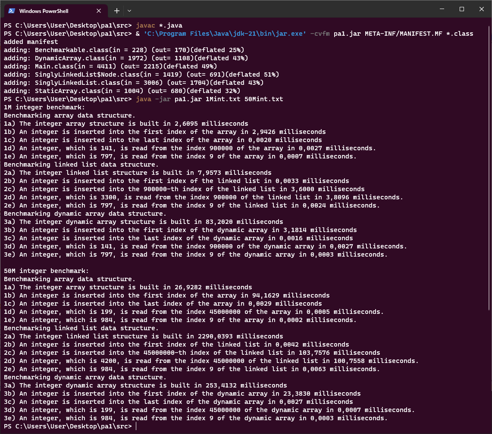

## Usage

Put your 1Mint.txt and 50Mint.txt files in the current working directory
<br/>("./" for option #1, "./src" for option #2 and #3)

1) Run pa1.jar (compiled with Oracle JDK 21)
   ```
   java -jar pa1.jar 1Mint.txt 50Mint.txt
   ```
2) Compile sources & run
   ```
   cd ./src
   javac *.java
   java Main 1Mint.txt 50Mint.txt
   ```
3) Create JAR file & run
   ```
   cd ./src
   javac *.java
   jar -cvfm pa1.jar META-INF/MANIFEST.MF *.class
   java -jar pa1.jar 1Mint.txt 50Mint.txt
   ```

---

## Group Members

* 21050141038, Yousif Harith Suhail Suhail
* 20050111034, Merter Çoban
* 20050111011, İbrahim Bahça
* 20050111008, Selçuk Gençay

---

## Output

