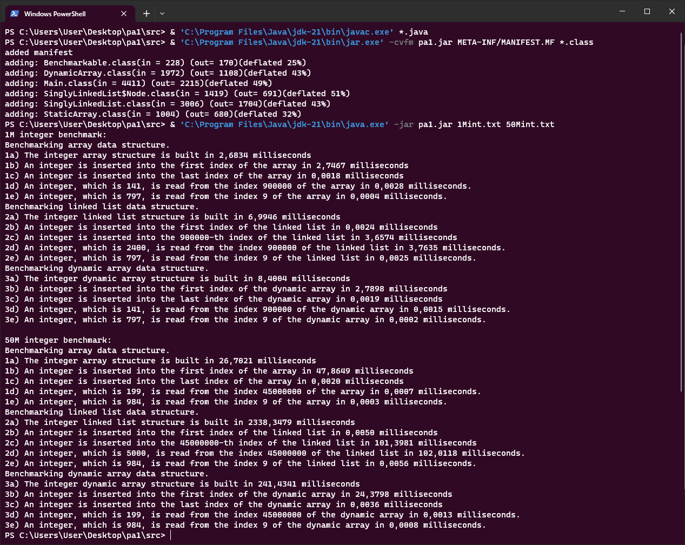

## Usage
1) Run pa1.jar <br/>
    `java -jar pa1.jar 1Mint.txt 50Mint.txt`
2) Compile sources & run <br/>
    ```
    javac *.java
    java Main 1Mint.txt 50Mint.txt
    ```
3) Create JAR file & run
    ```
    javac *.java
    jar -cvfm pa1.jar META-INF/MANIFEST.MF *.class
    java -jar pa1.jar 1Mint.txt 50Mint.txt
    ```
---
## Group Members
* 21050141038, Yousif Harith Suhail Suhail
* 20050111034, Merter Çoban
* 20050111011, İbrahim Bahça
* 20050111008, Selçuk Gençay
---
## Output
